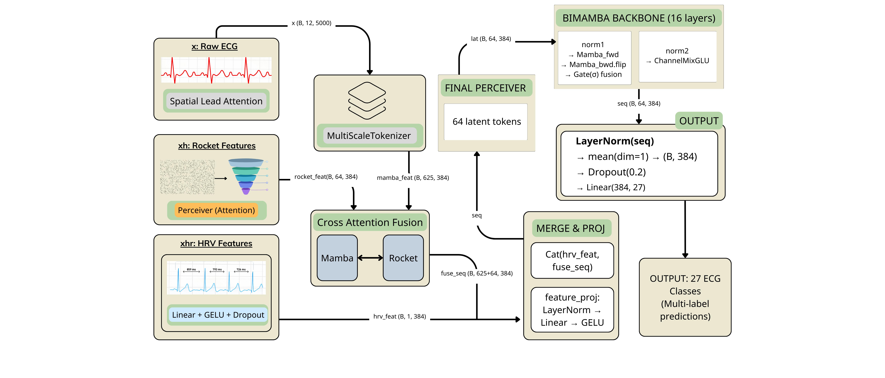

# ECG-RAMBA: Zero-Shot ECG Generalization by Morphology-Rhythm Disentanglement and Long-Range Modeling

[](https://arxiv.org/abs/2512.23347)
[](https://opensource.org/licenses/MIT)
[](https://www.python.org/downloads/)

This is the **Official PyTorch Implementation** of the paper:
**"ECG-RAMBA: Zero-Shot ECG Generalization by Morphology-Rhythm Disentanglement and Long-Range Modeling"**
_Hai Duong Nguyen, Xuan-The Tran (2025)_

📄 **[Paper (ArXiv)](https://arxiv.org/abs/2512.23347)** | 🤗 **[Model Weights](https://drive.google.com/drive/folders/1cVN8o8jVimZOrKIRFVXEm60RbIDx1zyU?usp=sharing)** | 📊 **[Experiments](EXPERIMENTS.md)**

---

## 📢 News

- **[2026-01-10]**: Code and pre-trained weights released.
- **[2025-12-30]**: Paper available on ArXiv.

---

## 📖 Abstract

Deep learning has achieved strong performance for electrocardiogram (ECG) classification within individual datasets, yet dependable generalization across heterogeneous acquisition settings remains a major obstacle. A key limitation of many model architectures is the implicit entanglement of morphological waveform patterns and rhythm dynamics, which can promote shortcut learning.

We propose **ECG-RAMBA**, a framework that separates morphology and rhythm and then re-integrates them through context-aware fusion.

<div align="center">
  
</div>

**Key Contributions:**

1.  **Disentangled Architecture**: Combines deterministic morphological features (**MiniRocket**) with global rhythm descriptors (**HRV**) and long-range contextual modeling (**Bi-Mamba**).
2.  **Context-Aware Fusion**: Re-integrates independent streams via Cross-Attention to capture non-linear interactions suitable for complex arrhythmias.
3.  **Power Mean Pooling ($Q=3$)**: A numerically stable pooling operator that emphasizes high-evidence segments without the brittleness of max pooling.
4.  **Zero-Shot Robustness**: Achieves state-of-the-art zero-shot transfer performance on standard benchmarks (CPSC-2021, PTB-XL).

---

## 💡 Key Innovations

### 1. Morphology-Rhythm Disentanglement

Unlike traditional CNNs that entangle waveform shapes with rhythm, **ECG-RAMBA** explicitly separates them:

- **Morphology Stream**: Uses **MiniRocket**, a deterministic convolution kernel ensuring consistent feature extraction regardless of training distribution.
- **Rhythm Stream**: Computes global HRV descriptors (RMSSD, SDNN, Poincaré) to capture long-term autonomic nervous system dynamics.

### 2. Bi-Directional Mamba Backbone

Leverages **State Space Models (SSM)** to model long-range dependencies across 5000-timepoint whole-signal ECGs with linear computational complexity $O(N)$, overcoming the quadratic bottleneck of Transformers.

### 3. Power Mean Pooling ($Q=3$)

Introduces a numerically stable pooling operator that improves sensitivity to transient abnormalities (like Paroxysmal AF). Unlike Max Pooling (brittle) or Average Pooling (diluting), Power Mean with $Q=3$ emphasizes high-evidence segments while remaining robust to noise.

### 4. Zero-Shot Generalization

Designed for **clinical reliability**:

- **No Test-Time Adaptation**: Works out-of-the-box on unseen datasets.
- **Fixed Threshold ($\tau=0.5$)**: No dataset-specific threshold tuning required.
- **Subject-Aware Protocol**: Strict evaluation preventing identity leakage.

---

## 🛠️ Installation

### Requirements

| Component | Requirement              |
| :-------- | :----------------------- |
| Python    | 3.10+                    |
| CUDA      | 11.8+ (for `mamba-ssm`)  |
| GPU VRAM  | 10GB+ (20GB recommended) |

### Setup

```bash
# 1. Clone repository
git clone https://github.com/BrianNguyen29/ECG-RAMBA.git
cd ECG-RAMBA

# 2. Install dependencies
pip install -r requirements.txt
```

> **Note**: The `mamba-ssm` library requires CUDA. For CPU-only inference, a fallback path is provided but performance will be significantly slower.

---

## 🚀 Usage

### 1. Data Preparation

Download datasets from PhysioNet (see [`data/README.md`](data/README.md)):

```text
data/
├── chapman/       # ~45k records (.mat and .hea files)
├── cpsc2021/      # For zero-shot AF detection
└── ptbxl/         # For zero-shot multi-class evaluation
```

### 2. Training

```bash
python scripts/train.py
```

- **Config**: `configs/config.py`
- **Logs**: `reports/logs/`
- **Checkpoints**: `models/fold*_best.pt`

### 3. Evaluation

```bash
# Out-of-Fold evaluation (Chapman)
python scripts/eval_oof.py

# Zero-Shot transfer (CPSC-2021, PTB-XL)
python scripts/eval_zeroshot.py
```

� For detailed reproduction instructions, see **[EXPERIMENTS.md](EXPERIMENTS.md)**.

---

## 📂 Project Structure

```text
ECG-RAMBA/
├── configs/            # Centralized configuration
├── data/               # Dataset storage (Git-ignored)
├── models/             # Pre-trained weights & checkpoints
├── notebooks/          # Demo & exploratory notebooks
├── reports/            # Figures and experimental logs
├── scripts/            # Training and evaluation scripts
├── src/                # Core source code
│   ├── model.py        # ECGRambaV7Advanced
│   ├── layers.py       # BiMamba, Perceiver, Fusion blocks
│   ├── features.py     # MiniRocket, HRV extraction
│   ├── data_loader.py  # Chapman data pipeline
│   └── utils.py        # Metrics, losses, EMA
└── web_app/            # Deployment application
```

---

## 📜 Citation

If you use this code or model in your research, please cite:

```bibtex
@article{nguyen2025ecg,
  title={ECG-RAMBA: Zero-Shot ECG Generalization by Morphology-Rhythm Disentanglement and Long-Range Modeling},
  author={Nguyen, Hai Duong and Tran, Xuan-The},
  journal={arXiv preprint arXiv:2512.23347},
  year={2025},
  url={https://arxiv.org/abs/2512.23347}
}
```

---

## 📄 License

This project is licensed under the MIT License. See [LICENSE](LICENSE) for details.

---

## 🤝 Contributing

We welcome contributions! Please read [CONTRIBUTING.md](CONTRIBUTING.md) for guidelines.

---

## 🙏 Acknowledgements

We thank the PhysioNet team for hosting the Chapman-Shaoxing, CPSC-2021, and PTB-XL datasets.
