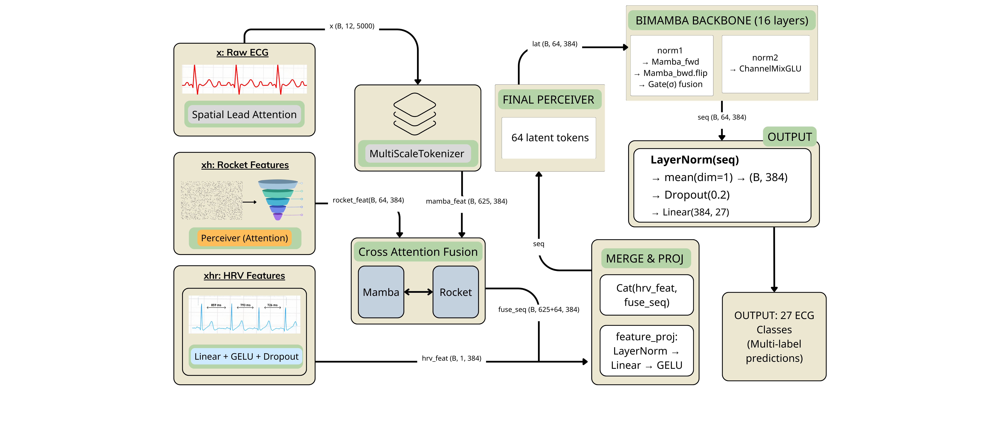
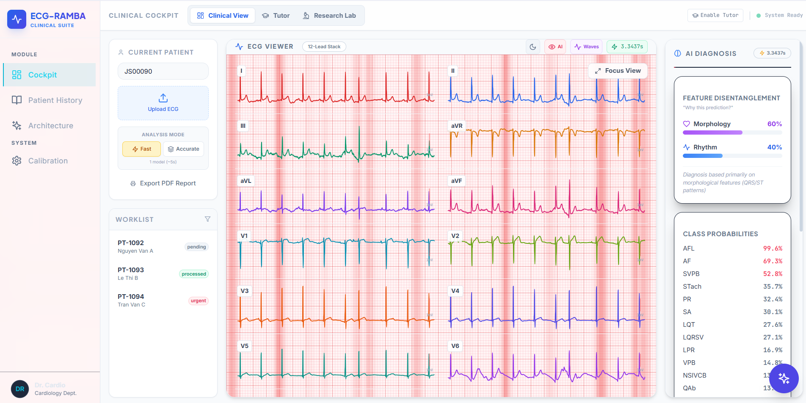

# ECG-RAMBA: A Protocol-Faithful Evaluation of Structured Morphology-Rhythm ECG Modeling

[](https://arxiv.org/abs/2512.23347)
[](https://opensource.org/licenses/MIT)
[](https://www.python.org/downloads/)

**Keywords:** ECG classification, structured morphology-rhythm interfaces, Mamba / SSM, fixed-seed ROCKET-family features, calibration, perturbation robustness, mapped external evaluation.

This is the **Official PyTorch Implementation** of the paper:
**"ECG-RAMBA: A Protocol-Faithful Evaluation of Structured Morphology-Rhythm ECG Modeling"**
_Hai Duong Nguyen, Xuan-The Tran (2025)_

📄 **[Paper (ArXiv)](https://arxiv.org/abs/2512.23347)** | 🤗 **[Model Weights](https://drive.google.com/drive/folders/1cVN8o8jVimZOrKIRFVXEm60RbIDx1zyU?usp=sharing)** | 📊 **[Experiments](EXPERIMENTS.md)**

## 🤗 Model Weights

Pretrained checkpoints are provided here:

- Google Drive: https://drive.google.com/drive/folders/1cVN8o8jVimZOrKIRFVXEm60RbIDx1zyU

**Expected files:**

- `fold1_best.pt`
- `fold2_best.pt`
- `fold3_best.pt`
- `fold4_best.pt`
- `fold5_best.pt`

**Recommended:** verify SHA256 checksums if you mirror weights to ensure integrity.

---

## 📢 News

- **[2026-01-10]**: Code and pre-trained weights released.
- **[2025-12-30]**: Paper available on ArXiv.

---

## 📖 Abstract

Deep learning has achieved strong performance for electrocardiogram (ECG) classification within individual datasets, yet behavior across heterogeneous acquisition settings remains difficult to characterize. This repository tests whether explicit morphology and rhythm interfaces provide benefits that survive matched comparisons in discrimination, calibration, perturbation robustness, and target-label adaptation.

We evaluate **ECG-RAMBA**, a framework with explicit morphology and rhythm interfaces that are re-integrated through context-aware fusion. The interface is an architectural hypothesis; representation probes and CKA are audits, not proof of mechanistic separation.

<div align="center">
  
</div>

**Key Contributions:**

1.  **Structured Interfaces**: Combines a fixed-seed ROCKET-family MAX+PPV morphology transform, checkpoint-compatible rhythm/statistical conditioning, and long-range contextual modeling with Bi-Mamba.
2.  **Matched Controls**: Uses same-fold learned comparators, structured ablations, paired record-level uncertainty estimates, and explicit claim boundaries.
3.  **Pooling Audit**: Freezes power-mean pooling at $Q=3$ and reports sensitivity against alternative aggregation rules rather than claiming universal optimality.
4.  **External and Adaptation Audits**: Reports dataset-specific mapped tasks, zero-target-label inference, score calibration, and frozen-encoder head adaptation as distinct protocols.

---

## 💡 Key Innovations

### 1. Morphology-Rhythm Interfaces

**ECG-RAMBA** exposes morphology and rhythm as explicit model interfaces:

- **Morphology Stream**: Uses a fixed-seed ROCKET-family ternary-kernel transform with MAX+PPV summaries. It is not the canonical MiniRocket algorithm.
- **Rhythm Stream**: Uses the rhythm/statistical inputs implemented by the frozen checkpoint contract. Reserved amplitude slots remain zero; the released checkpoints do not implement a full RMSSD/SDNN/LF-HF feature set.

### 2. Bi-Directional Mamba Backbone

Leverages **State Space Models (SSM)** to model long-range dependencies across 5000-timepoint whole-signal ECGs with linear computational complexity $O(N)$, overcoming the quadratic bottleneck of Transformers.

### 3. Power Mean Pooling ($Q=3$)

Uses a numerically stable power-mean operator with the frozen operating point $Q=3$ to emphasize high-evidence segments without reducing each record to its single largest slice score. The revision reports paired sensitivity analyses against mean, max, and alternative power values; $Q=3$ is a fixed design choice rather than a universally optimal or generally robust pooling rule.

### 4. External Mapped-Task Evaluation

The external protocol records model behavior without expanding it into a deployment claim:

- **Zero-Target-Label Inference**: Evaluates frozen weights before any target-label use.
- **Fixed Threshold ($\tau=0.5$)**: No dataset-specific threshold tuning required.
- **Group-Aware Protocol**: Uses dataset-specific group splits and separates score calibration from frozen-encoder head adaptation.

---

## ⚡ Quickstart (Inference)

```bash
git clone https://github.com/BrianNguyen29/ECG-RAMBA.git
cd ECG-RAMBA
pip install -r requirements.txt
# Inference with pre-trained weights (ensure models/fold1_best.pt exists)
python scripts/eval_zeroshot.py --ckpt models/fold1_best.pt
```

## 🛠️ Installation

### Requirements

| Component | Requirement              |
| :-------- | :----------------------- |
| Python    | 3.10+                    |
| CUDA      | 11.8+ (for `mamba-ssm`)  |
| GPU VRAM  | 10GB+ (20GB recommended) |

### Setup

```bash
# 1. Clone repository
git clone https://github.com/BrianNguyen29/ECG-RAMBA.git
cd ECG-RAMBA

# 2. Install dependencies
pip install -r requirements.txt
```

> **Note**: Full ECG-RAMBA inference requires a compatible `mamba-ssm` runtime and is run on CUDA in the supported revision workflow. Metric recomputation, protocol gates, paired ledgers, and final evidence generation can run on CPU after prediction artifacts are available.

---

## 🚀 Usage

## 📊 Datasets

This repository supports standard ECG benchmarks. Download from PhysioNet and organize as follows:

```text
data/
├── chapman/       # ~45k records (.mat and .hea files)
├── cpsc2021/      # Annotation-aligned AF/AFL mapped-window evaluation
└── ptbxl/         # Mapped-superclass external evaluation
```

- **Chapman-Shaoxing** (large-scale 12-lead ECG)
- **CPSC 2021** (annotation-aligned AF/AFL mapped-window task)
- **PTB-XL** (multi-label ECG classification)

See [`data/README.md`](data/README.md) for preprocessing steps and file structure.

### 2. Training

```bash
python scripts/train.py
```

- **Config**: `configs/config.py`
- **Logs**: `reports/logs/`
- **Checkpoints**: `models/fold*_best.pt`

### 3. Evaluation

```bash
# Out-of-Fold evaluation (Chapman)
python scripts/eval_oof.py

# Legacy script name; external outputs require dataset-specific protocol gates
python scripts/eval_zeroshot.py
```

### CPU-only Evidence Checks

CPU runtimes are supported for the post-inference audit stages documented in `EXPERIMENTS.md`. Do not use the command below as a substitute for the CUDA/Mamba inference contract.

```bash
python -u scripts/revision/47_forensic_notebook_audit.py --canonical-root reports/revision
```

For detailed reproduction instructions, see **[EXPERIMENTS.md](EXPERIMENTS.md)**.

---

## 📂 Project Structure

```text
ECG-RAMBA/
├── configs/            # Centralized configuration
├── data/               # Dataset storage (Git-ignored)
├── models/             # Pre-trained weights & checkpoints
├── notebooks/          # Demo & exploratory notebooks
├── reports/            # Figures and experimental logs
├── scripts/            # Training and evaluation scripts
├── src/                # Core source code
│   ├── model.py        # ECGRamba
│   ├── layers.py       # BiMamba, Perceiver, Fusion blocks
│   ├── features.py     # Fixed-seed ROCKET-family and rhythm/statistical features
│   ├── data_loader.py  # Chapman data pipeline
│   └── utils.py        # Metrics, losses, EMA
└── web_app/            # Research visualization and inference demo
```

---

## 💻 Web Application

The repository includes a React/FastAPI research interface for waveform inspection and model-output visualization. It is a software demonstration, not a validated medical device or clinical decision-support system.

<div align="center">
  
</div>

### Key Features:

1.  **Waveform Workbench**:
    - **12-Lead Visualization**: High-fidelity rendering (500Hz) with medical grid system (5mm/1mm).
    - **Focus Analysis**: Interactive zoom, pan, and single-lead detailed inspection.
    - **Digital Calipers**: Precision measurement tools for $\Delta t$ (ms) and $\Delta V$ (mV).
2.  **AI Integration**:
    - **Interactive Inference**: Mamba2-backed model-output visualization for uploaded research records.
    - **Saliency View**: Gradient-based maps for exploratory inspection of model sensitivity on the waveform.
    - **Confidence Scoring**: Probability distribution over 4 diagnostic classes (Normal, AFib, GSVT, SB).
3.  **Reporting & Workflow**:
    - **PDF Export**: One-click generation of research-session summaries for uploaded files.
    - **Patient Queue**: Drag-and-drop file upload (`.mat`, `.csv`, `.json`) and history tracking.

### Run Web App (Local)

```bash
cd web_app
# backend
cd backend
pip install -r requirements.txt
uvicorn main:app --reload

# frontend
cd ../frontend
npm install
npm run dev
```

---

## 📜 Citation

If you use this code or model in your research, please cite:

```bibtex
@article{nguyen2025ecg,
  title={ECG-RAMBA: A Protocol-Faithful Evaluation of Structured Morphology-Rhythm ECG Modeling},
  author={Nguyen, Hai Duong and Tran, Xuan-The},
  journal={arXiv preprint arXiv:2512.23347},
  year={2025},
  url={https://arxiv.org/abs/2512.23347}
}
```

---

## 📄 License

This project is licensed under the MIT License. See [LICENSE](LICENSE) for details.

---

## 🤝 Contributing

We welcome contributions! Please read [CONTRIBUTING.md](CONTRIBUTING.md) for guidelines.

---

## 🙏 Acknowledgements

We thank the PhysioNet team for hosting the Chapman-Shaoxing, CPSC-2021, and PTB-XL datasets.
